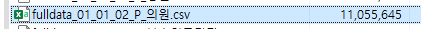
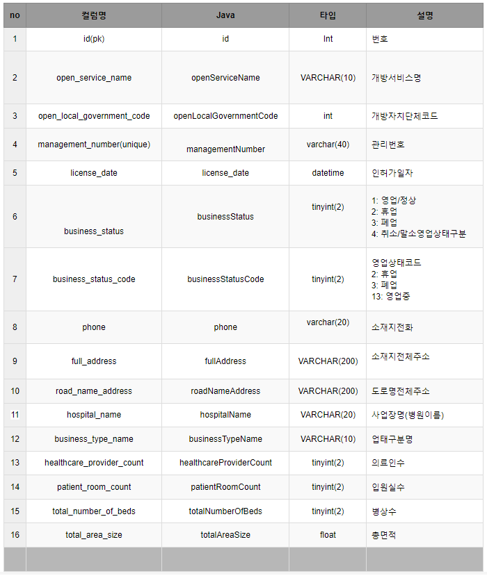
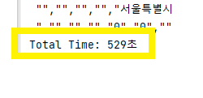
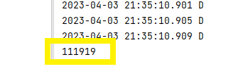
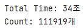
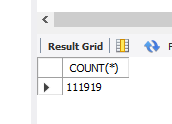

# 📌 전국 병/의원 대용량 데이터 처리

## ✅ 병/의원 데이터
* 데이터 출처: <a href="https://www.localdata.go.kr/devcenter/dataDown.do?menuNo=20001">LOCAL DATA</a>
* 약 11만 건의 전국 병/의원 정보 데이터 .csv 파일
* 대용량 데이터를 원하는 정보만으로 가공하여 DB에 Insert 할 수 있다.



## ✅ DB Table
* 데이터 파일의 많은 컬럼 중 아래의 컬럼으로 DB 테이블 구성



## ✅ 프로젝트 빌드
```
dependencies {
    implementation 'org.springframework.boot:spring-boot-starter-data-jdbc'
    implementation 'org.springframework.boot:spring-boot-starter-web'
    compileOnly 'org.projectlombok:lombok'
    runtimeOnly 'com.mysql:mysql-connector-j'
    annotationProcessor 'org.projectlombok:lombok'
    testCompileOnly 'org.projectlombok:lombok'
    testAnnotationProcessor 'org.projectlombok:lombok'
    testImplementation 'org.springframework.boot:spring-boot-starter-test'
}
```

## 🛠 데이터 파싱(가공)
### `readByLine()` 메서드로 데이터 파일 한 줄씩 읽어오기
* <a href="https://github.com/mingry2/parser-practice/blob/main/src/main/java/com/example/parser/parser/ReadLineContext.java">ReadLineContext.java</a>
* 'Buffer(버퍼)'를 사용하는 `BufferedReader` 클래스로 입력 효율을 높여줄 수 있다.
* 파싱 중 가져오는 컬럼에 null 값이 있는 경우는 Excepion으로 에러를 넘겨 읽어오는 데이터에서 제외 시킨다.

### `parse()` 메서드로 읽어온 한 줄의 데이터를 파싱
* `Parser<Hospital>`에 `parse()` 메서드를 사용하여 `,` 를 기준으로 데이터를 나눈다.

### 파싱 된 데이터 `hospitals` 리스트에 `.add`

## 🛠 `jdbcTemplate.update()`로 DB Insert(한줄씩 Insert)
```java
@Component
public class HospitalDto {
	private final JdbcTemplate jdbcTemplate;


	public HospitalDto(JdbcTemplate jdbcTemplate) {
		this.jdbcTemplate = jdbcTemplate;
	}

	//insert
	public void add(Hospital hospital) {
		String sql ="INSERT INTO `parser_db`.`hospital` \n" +
				"(`id`, `open_service_name`, `open_local_government_code`, `management_number`, `license_date`, " +
				"`business_status`, `business_status_code`, `phone`, `full_address`, `road_name_address`, `hospital_name`, " +
				"`business_type_name`, `healthcare_provider_count`, `patient_room_count`, `total_number_of_beds`, `total_area_size`) \n" +
				"VALUES (?,?,?," +
				"?,?,?," +
				"?,?,?," +
				"?,?,?," +
				"?,?,?," +
				"?);";

		this.jdbcTemplate.update(sql,
				hospital.getId(),
				hospital.getOpenServiceName(),
				hospital.getOpenLocalGovernmentCode(),
				hospital.getManagementNumber(),
				hospital.getLicenseDate(),
				hospital.getBusinessStatus(),
				hospital.getBusinessStatusCode(),
				hospital.getPhone(),
				hospital.getFullAddress(),
				hospital.getRoadNameAddress(),
				hospital.getHospitalName(),
				hospital.getBusinessTypeName(),
				hospital.getHealthcareProviderCount(),
				hospital.getPatientRoomCount(),
				hospital.getTotalNumberOfBeds(),
				hospital.getTotalAreaSize()
		);
	}
}
```
* 총 insert 시간


* insert 된 데이터 수



### 💡 약 11만 건의 데이터를 Insert 할 때 `jdbcTemplate.update()`를 사용하면 Insert 시간이 오래걸림

## 🛠 `jdbcTemplate.batchUpdate()`로 DB Insert(일괄 Insert)
* <a href="https://github.com/mingry2/parser-practice/blob/main/src/main/java/com/example/parser/domain/dto/HospitalDto.java">HospitalDto.java</a>
* `jdbcTemplate.batchUpdate()` 사용 시 동일한 건수인데도 총 시간이 현저히 줄어든것을 확인할 수 있음


* DB Insert

